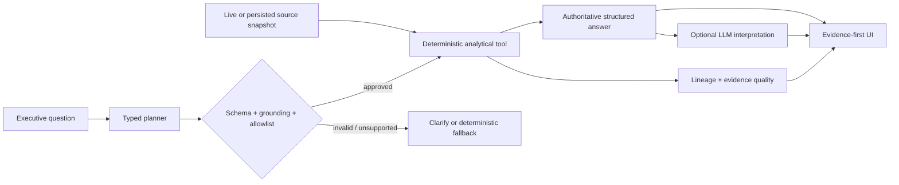
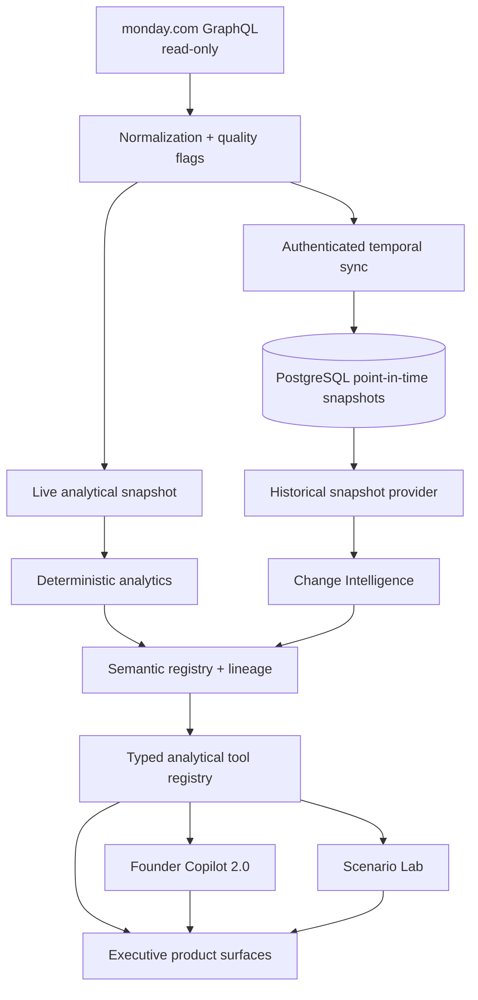

# Skylark Command

### Trust-native executive decision intelligence over live CRM and operational data

**Ask what changed. See why. Verify the evidence. Decide what happens next.**

Skylark Command turns live monday.com Deals and Work Orders into deterministic business analytics, historical change intelligence, Customer 360, scenario analysis, and natural-language decision support. The defining constraint is simple: **AI may interpret an answer, but it does not own the business arithmetic.**

[Live app](https://skylark-command.vercel.app) · [Architecture](docs/ARCHITECTURE.md) · [Trust model](docs/TRUST_MODEL.md) · [90-second demo](docs/DEMO.md) · [Technical case study](docs/CASE_STUDY.md)

> The public deployment can lag the repository's V2 branch. Before demonstrating historical Change Intelligence or Scenario Lab, verify that the deployed SHA includes those capabilities and that temporal storage is configured. No mock history is used as a substitute.

## Why it is different

Most conversational BI demos optimize for fluent answers. Skylark Command optimizes for **defensible answers**.

| Principle | Product behavior |
| --- | --- |
| **Deterministic truth** | TypeScript owns normalization, filters, joins, rankings, deltas, and business arithmetic. |
| **Explicit semantics** | A versioned semantic registry defines metrics, dimensions, allowed joins, and canonical questions. |
| **Evidence before confidence** | Answers can carry source snapshots, record IDs, coverage, lineage, caveats, and evidence-quality classifications. |
| **Time is first-class** | Persisted point-in-time snapshots support change detection without reconstructing or fabricating history. |
| **AI is bounded** | Gemini can propose typed analytical tools and explain computed results; schema, grounding, and allowlists constrain execution. |
| **Unknown stays unknown** | Missing values remain `null`; known-only totals disclose coverage rather than treating missing data as zero. |
| **Scenarios are isolated** | What-if overrides run against cloned snapshots and never mutate monday.com source records. |

## What it can do

### Founder Copilot 2.0

Ask business questions in natural language, continue with structured follow-ups, and receive answers backed by approved analytical tools. The Copilot supports pipeline, sector/stage analysis, customer contribution, Customer 360, receivables, Work Order health, period comparisons, Change Intelligence, and Scenario Lab.

### Change Detective

Compare available point-in-time snapshots to answer questions such as `What changed since last week?`, `What changed in pipeline?`, or `Which customers changed the most?`. When durable history is unavailable or too sparse, the product says so instead of inventing a comparison baseline.

### Customer 360

Join commercial and operational evidence using an exact normalized client key. Inspect pipeline exposure, won-value evidence, Work Orders, billing/collections context, receivables, execution risk, and contribution without fuzzy identity matching.

### Scenario Lab

Run bounded what-if analysis such as moving a Deal close period, changing an outcome, applying a receivable payment, delaying a Work Order, or resolving an operational item. Every scenario follows:

`immutable baseline + validated overrides → cloned hypothetical snapshot → same deterministic analytics → BASELINE / SCENARIO / DELTA`

### Evidence-first executive UI

Overview, Pipeline, Operations, Leadership, Data Health, Change Detective, Customer 360, and Founder Copilot use responsive visualizations, freshness/coverage signals, explicit caveats, and evidence surfaces rather than hiding data quality behind prose.

## Why the answers are trustworthy

Skylark separates three classes of output:

- **FACT** — deterministic analytics computed from configured source records and persisted snapshots.
- **ESTIMATE** — explicitly labeled statistical techniques, such as materiality thresholds derived from observed data distributions.
- **INTERPRETATION** — optional LLM wording over an already-computed analytical result.

The LLM is not allowed to silently promote an interpretation into a fact. See the full [Trust Model](docs/TRUST_MODEL.md).



## Architecture



Detailed component boundaries, temporal flow, and failure behavior are in [docs/ARCHITECTURE.md](docs/ARCHITECTURE.md).

## Product surfaces

| Route | Purpose |
| --- | --- |
| `/` | Executive overview and Founder Attention |
| `/changes` | Change Detective over available historical snapshots |
| `/copilot` | Founder Copilot 2.0, structured answers, trust trace, and Scenario Lab |
| `/customers/[clientKey]` | Customer 360 |
| `/pipeline` | Pipeline, stage/sector and risk intelligence |
| `/operations` | Work Order, billing, collections, and receivables health |
| `/leadership` | Deterministic Leadership Brief |
| `/data-health` | Missing, malformed, unmapped, stale, and coverage evidence |
| `/api/chat` | Canonical Copilot API |
| `/api/health` | Configuration-safe health metadata |
| `/api/internal/sync/monday` | Authenticated temporal snapshot sync endpoint |

## Tech stack

| Layer | Technology |
| --- | --- |
| Web application | Next.js 16 App Router, React 19, TypeScript 5.9 |
| Validation | Zod |
| Source integration | monday.com GraphQL over server-side `fetch` |
| Temporal storage | PostgreSQL via `postgres` |
| AI interpretation/planning | Google Gemini, optional and server-only |
| Styling | Tailwind CSS 4 plus application CSS |
| Tests | Node test runner via `tsx`, Vitest |
| Hosting target | Vercel / Node.js runtime |

No technology is listed here unless it exists in the repository or runtime contract.

## Data and trust pipeline

1. **Fetch** configured monday.com boards server-side using paginated, query-only GraphQL.
2. **Normalize** source cells into typed Deals and Work Orders; malformed or missing values remain explicit.
3. **Serve** either live data or a successful temporal snapshot according to `SKYLARK_DATA_MODE`.
4. **Persist** successful point-in-time snapshots when temporal sync is configured.
5. **Calculate** business metrics in deterministic analytics functions.
6. **Describe** those metrics through the semantic registry instead of redefining arithmetic in the AI layer.
7. **Execute** only typed, allowlisted analytical tools.
8. **Attach** lineage, source references, filters, evidence coverage, and caveats.
9. **Interpret** optionally with Gemini after authoritative data exists.
10. **Render** the structured result and its trust evidence in the UI.

## Security boundaries

- Server-only monday.com, database, cron, and Gemini credentials.
- monday.com client rejects mutation documents and uses query-only access patterns.
- Strict request schemas, bounded body/message sizes, request IDs, safe public errors, and timeouts.
- Prompt-injection defenses separate user/source data from system instructions.
- LLM tool proposals must pass Zod validation, allowlist checks, source-entity grounding, and context grounding.
- Provider failure degrades interpretation, not deterministic analytics.
- Scenario analysis operates on cloned data and has no source-write path.
- Current rate limiting is process-local; distributed enforcement remains a production-hardening item.

See [docs/TRUST_MODEL.md](docs/TRUST_MODEL.md) and [docs/RELEASE.md](docs/RELEASE.md).

## Testing and quality gates

The repository uses separate deterministic analytics, temporal/history, Change Intelligence, Customer 360, customer-contribution, semantic-layer, Copilot, injection/security, visualization, and server-reliability tests. Rather than pinning a test count that will become stale, the release gate is defined by commands:

```bash
npm ci
npm test
npm run lint
npm run build
```

A release candidate should also pass route/API smoke checks, tracked-secret review, and a live-source sanity check where credentials are available. See [docs/RELEASE.md](docs/RELEASE.md).

## Local setup

Requires Node.js 20.9+.

```bash
git clone https://github.com/Rishikeshsanin/skylark-command.git
cd skylark-command
npm ci
cp .env.example .env.local
npm run dev
```

Open `http://localhost:3000`.

Minimal live-data configuration:

```dotenv
MONDAY_API_TOKEN=<server-side token>
MONDAY_DEALS_BOARD_ID=<deals board id>
MONDAY_WORK_ORDERS_BOARD_ID=<work-orders board id>
```

Temporal history is optional. When enabled, configure `DATABASE_URL`, `CRON_SECRET`, and a temporal data mode; see [Deployment](docs/DEPLOYMENT.md).

## Demo

The recommended recruiter/product walkthrough is intentionally short:

1. Open Overview and explain the trust-native thesis.
2. Ask `What changed since last week?`.
3. Open the answer evidence/lineage.
4. Inspect one customer in Customer 360.
5. Ask which customers contributed to a result.
6. Run a bounded scenario.
7. Close with Data Health and FACT / ESTIMATE / INTERPRETATION.

If the deployed environment does not have enough historical snapshots, use the documented alternate path instead of pretending that history exists. See [docs/DEMO.md](docs/DEMO.md).

## Screenshots

The existing `Screenshots/` directory is preserved as a real production reference from the earlier public deployment. It is **not** labeled as proof of every V2 capability.

A V2 gallery is intentionally gated on real V2 captures. The exact capture checklist and filenames live in [docs/screenshots/README.md](docs/screenshots/README.md).

## Documentation

- [Architecture](docs/ARCHITECTURE.md)
- [Trust Model](docs/TRUST_MODEL.md)
- [Demo Script](docs/DEMO.md)
- [Technical Case Study](docs/CASE_STUDY.md)
- [Data Contracts](docs/DATA_CONTRACTS.md)
- [Semantic Layer](docs/SEMANTIC_LAYER.md)
- [Copilot & Scenario Lab](docs/V2_COPILOT_SCENARIO.md)
- [Deployment](docs/DEPLOYMENT.md)
- [Release & Quality Gates](docs/RELEASE.md)
- [Roadmap](docs/ROADMAP.md)
- [Portfolio / Resume Notes](docs/PORTFOLIO.md)
- [Decision Log](docs/DECISION_LOG.md)

## Roadmap snapshot

**Shipped:** deterministic executive analytics, live monday.com integration, temporal snapshot infrastructure, Change Intelligence, Customer 360, semantic lineage/evidence, typed Copilot tools, Scenario Lab, Data Health, visualizations, provider fallback.

**Next:** operationalize scheduled snapshot capture, strengthen distributed runtime controls, improve evidence navigation, and capture a clean V2 screenshot/demo set.

**Future / research:** pipeline conversion, collections risk, and delivery-risk prediction **only after sufficient point-in-time historical data exists for defensible training and evaluation**. No predictive ML model is claimed as shipped today.

---

### Product philosophy

> **Ask what changed. See why. Verify the evidence. Decide what happens next.**
