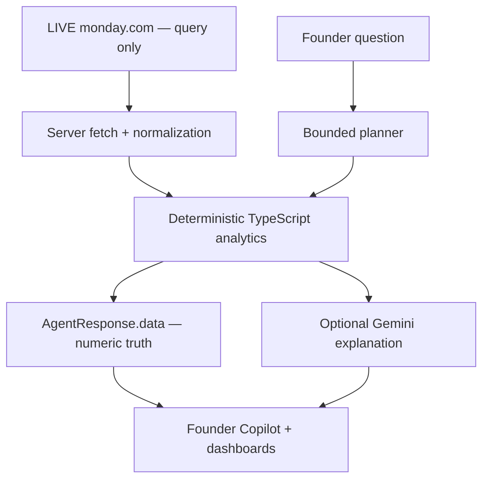

# Skylark Command

### Founder-grade conversational BI over live monday.com data

Skylark Command turns live Deals and Work Orders into executive dashboards, a Founder Attention Feed, a Leadership Brief, and a conversational copilot. Business arithmetic stays in deterministic TypeScript; Gemini can explain the result, but it never owns the numbers.

> **LIVE DEMO:** https://skylark-command.vercel.app
>
> **Final integrated application:** [`0a0ee75522635c4259f9fefaf40d63e136fbea58`](https://github.com/Rishikeshsanin/skylark-command/commit/0a0ee75522635c4259f9fefaf40d63e136fbea58)
>
> **Release state:** production deployment is live on Vercel. The final integrated release preserves deterministic BI, live read-only monday.com access, responsive executive dashboards, and Founder Copilot visual analytics.

## Executive overview

| Concern | Skylark Command approach |
| --- | --- |
| Runtime source | Live, paginated monday.com Deals + Work Orders; no embedded assignment dataset |
| Numeric truth | Deterministic normalization, joins, filters, rankings, and aggregations |
| AI role | Optional Gemini narration over already-computed structured facts |
| Executive experience | Overview, Pipeline, Operations, Leadership Brief, Data Health, and Founder Copilot |
| Incomplete data | Nulls remain unknown; known-only totals disclose their coverage |
| Safety boundary | Server-only secrets, query-only monday access, validation, rate limiting, request IDs, and safe errors |

What makes the submission intentional:

- **Deterministic numbers, AI explanation.** Pipeline, won value, receivables, rankings, and joins never depend on model arithmetic.
- **Honest coverage.** Missing monetary values are excluded from known-only sums and surfaced as unknown, not silently converted to zero.
- **Live runtime data.** The server queries monday.com on demand with `cache: "no-store"` and pagination.
- **Cross-board intelligence.** Exact normalized client keys connect commercial Deals with Work Order execution and collections exposure.
- **Founder workflows.** The Attention Feed and Leadership Brief prioritize decisions rather than only displaying charts.
- **Read-only and server-side by design.** The monday client rejects mutations, and provider credentials never enter the browser bundle.

## Architecture



The bounded planner selects a supported deterministic analysis. `AgentResponse.data` remains authoritative; the explanation provider receives a constrained representation of those facts and cannot replace the structured result.

## Features

| Area | Capabilities |
| --- | --- |
| Pipeline | Open pipeline, known won value, stage/sector breakdowns, risky deals, and missing-value coverage |
| Periods | Explicit-quarter, current-quarter, and latest-available-period behavior without fake zero performance |
| Operations | Work Order execution health, billing, collections, receivables, delays, and incomplete-field handling |
| Customers | Exact cross-board matching and four explicit deterministic customer-ranking definitions |
| Founder Attention | Commercial, delivery, receivables, stale-deal, concentration, and data-quality signals |
| Leadership Brief | Deterministic executive snapshot with priorities and caveats |
| Data Health | Missing, malformed, unmapped, and potentially stale source-data findings |
| Founder Copilot | Structured answers, clarification flows, source provenance, provider fallback, and safe errors |

## Live acceptance baseline

These values are the configured-live verification baseline for the two monday.com boards. They are **acceptance evidence, not hardcoded runtime data**.

| Metric | Expected live value |
| --- | ---: |
| Deals | 346 total |
| Open deals | 49 |
| Won deals | 165 |
| Known open pipeline | 688152293.17 INR |
| Known won value | 95038938.98 INR |
| Won-value coverage | 64 known-value deals; 101 unknown-value deals |
| Work Orders | 176 |
| Known receivables | 36291748.87 INR |
| Unique Work Order client keys | 51 |
| Exact cross-board matches | 50 |
| Unmatched client keys | 1 — `COMPANY042` |

Known open and won monetary values exclude records whose monetary value is missing. In particular, **known won value is not presented as full historical revenue**.

## Data-quality philosophy

- Missing or malformed values normalize to `null`, with quality evidence where relevant.
- Known-only monetary sums never impute an average or treat unknown as zero.
- Record counts and value-coverage counts stay visible beside material monetary answers.
- Cross-board presence means an exact intersection of unique normalized client keys—never fuzzy name matching.
- A requested current quarter with no usable records remains a no-data result and surfaces latest-available context when possible.
- Time-dependent analytics receive an explicit analysis date so results are deterministic and testable.

## AI trust boundary

The optional provider uses **`gemini-2.5-flash-lite`** for executive explanation only.

- Gemini never calculates pipeline, revenue, won value, receivables, counts, ranks, or percentages.
- Structured deterministic `AgentResponse.data` is the numeric source of truth rendered by the UI.
- Generated prose is schema-validated with a numeric-prose guard; model text containing digits is rejected.
- Provider absence, timeout, rate limit, malformed output, or trust-guard failure triggers a deterministic explanation fallback while preserving the analytical result.
- User text and monday-sourced text are serialized as untrusted data and separated from system instructions.

Key precedence is `GEMINI_API_KEY`, then the backward-compatible `AI_API_KEY`. Both remain optional and server-only.

## Security boundaries

- Server-only monday.com and Gemini credentials; no secret uses a `NEXT_PUBLIC_` prefix
- GraphQL query helpers only, with explicit mutation rejection
- Strict JSON schema and bounded input for `POST /api/chat`
- Rate limiting, request IDs, timeouts, safe public error envelopes, and no-store API responses
- Content Security Policy and additional response security headers
- Prompt-injection and untrusted-source-data separation
- Canonical `POST /api/chat`; no competing production chat backend

The evaluator-facing hosted preview intentionally prioritizes frictionless reviewer access. Production hardening would add organization SSO/RBAC, deployment-level access controls, and distributed rate limiting; the trade-off is recorded in the [Decision Log](docs/DECISION_LOG.md).

## Evaluator demo

Use the [five-minute evaluator script](docs/EVALUATOR_DEMO_SCRIPT.md), or ask:

- `How is our pipeline looking?`
- `Which sector has the largest open opportunity?`
- `Who are our best customers?`
- `What is our won value?`
- `What are our receivables?`
- `Which customers appear in both boards?`
- `How are we doing this quarter?`
- `Which projects need leadership attention?`
- `What data should I not trust?`
- `Prepare a leadership brief.`

“Who are our best customers?” intentionally requires a definition rather than inventing one:

1. Highest won value
2. Largest active pipeline
3. Best project execution
4. Combined commercial + operational importance

Each selection dispatches to a deterministic ranking function.

## Testing and QA

Final release validation includes clean install/audit, deterministic analytics tests, component regressions, lint, production build, responsive browser smoke, API validation, and committed-secret scanning. The final visual passes added focused coverage for dashboard presentation, Copilot visual analytics, clarification behavior, and safe follow-up handling.

Run locally from the exact checked-out release state:

```bash
npm ci
npm test
npm run lint
npm run build
```

For a reachable candidate:

```bash
BASE_URL="https://your-preview.example" npm run smoke
BASE_URL="https://your-preview.example" SMOKE_CHAT=1 npm run smoke
```

## Local setup

Requires Node.js 20.9+.

```bash
git clone https://github.com/Rishikeshsanin/skylark-command.git
cd skylark-command
npm ci
cp .env.example .env.local
npm run dev
```

Open `http://localhost:3000`.

## Environment variables

| Variable | Requirement | Purpose |
| --- | --- | --- |
| `MONDAY_API_TOKEN` | Required, secret | Server-side monday.com read access |
| `MONDAY_DEALS_BOARD_ID` | Required, non-secret | Deals board: `5030844099` |
| `MONDAY_WORK_ORDERS_BOARD_ID` | Required, non-secret | Work Orders board: `5030844103` |
| `GEMINI_API_KEY` | Optional, secret | Preferred Gemini explanation key |
| `AI_API_KEY` | Optional, secret | Backward-compatible fallback when `GEMINI_API_KEY` is unset |

Configure `.env.local` without committing it:

```dotenv
MONDAY_API_TOKEN=<server-side token>
MONDAY_DEALS_BOARD_ID=5030844099
MONDAY_WORK_ORDERS_BOARD_ID=5030844103

# Optional explanation provider
GEMINI_API_KEY=<server-side key>

# Optional backward-compatible fallback when GEMINI_API_KEY is unset
AI_API_KEY=<server-side key>
```

The monday board IDs are non-secret configuration; tokens and provider keys are secrets.

## Routes

| Route | Purpose |
| --- | --- |
| `/` | Executive overview and Founder Attention Feed |
| `/copilot` | Founder Copilot |
| `/pipeline` | Pipeline intelligence |
| `/operations` | Work Order, billing, collections, and receivables health |
| `/leadership` | Leadership Brief |
| `/data-health` | Deterministic data-quality findings |
| `/api/health` | Service and configuration metadata |
| `/api/chat` | Canonical Founder Copilot API |

## Deployment

Production is deployed at **https://skylark-command.vercel.app**. See [Deployment Readiness](docs/DEPLOYMENT.md) and the [Final Submission Runbook](docs/SUBMISSION_CHECKLIST.md) for environment and verification details. `GET /api/health` verifies configuration presence; the configured-live baseline should also be checked in the product.

## Decision Log

The concise [Decision Log](docs/DECISION_LOG.md) records the trust and release trade-offs behind deterministic BI, live/read-only monday access, explanation-only Gemini, known-only totals, explicit clarification, exact client matching, period handling, testable analysis dates, fallback behavior, and evaluator-accessible hosting.

## Screenshots

Real production screenshots follow the capture and naming plan in [`docs/screenshots/README.md`](docs/screenshots/README.md). The live demo above is the authoritative final product experience.

## Project map

| Path | Responsibility |
| --- | --- |
| `src/lib/monday` | Server-only, paginated, query-only monday client |
| `src/lib/normalization` | Typed parsing, normalization, and quality evidence |
| `src/lib/analytics` | Deterministic BI, rankings, periods, joins, attention, and briefs |
| `src/lib/agent` | Bounded planning, dispatch, response composition, Gemini, and fallback |
| `src/app/api` | Health and canonical chat routes |
| `src/components` | Executive dashboards and structured Copilot rendering |
| `tests` and `*.test.ts` | Deterministic, security, evaluator, and presentation regressions |
| `docs` | Architecture decisions, QA evidence, deployment, demo, and submission runbook |

## Release documents

- [Decision Log](docs/DECISION_LOG.md)
- [Evaluator Demo Script](docs/EVALUATOR_DEMO_SCRIPT.md)
- [Release QA Status](docs/RELEASE_QA.md)
- [Deployment Readiness](docs/DEPLOYMENT.md)
- [Final Submission Runbook](docs/SUBMISSION_CHECKLIST.md)
