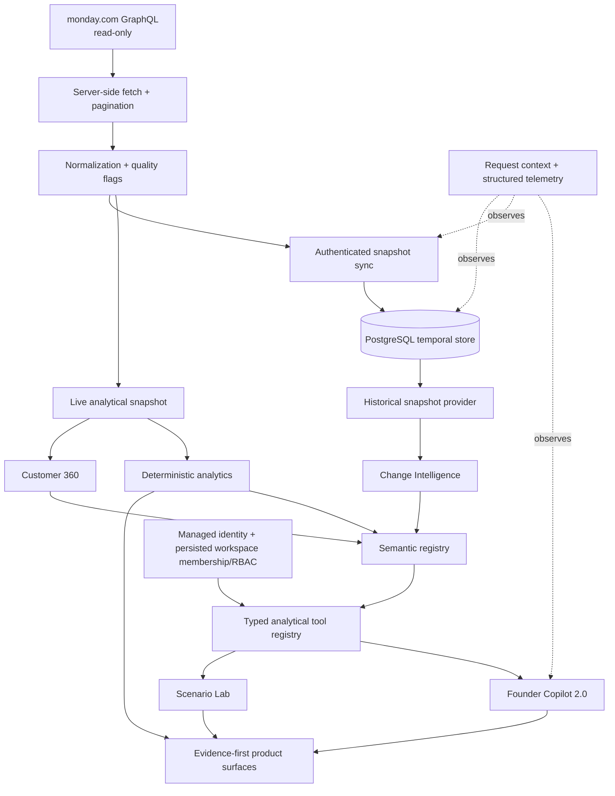
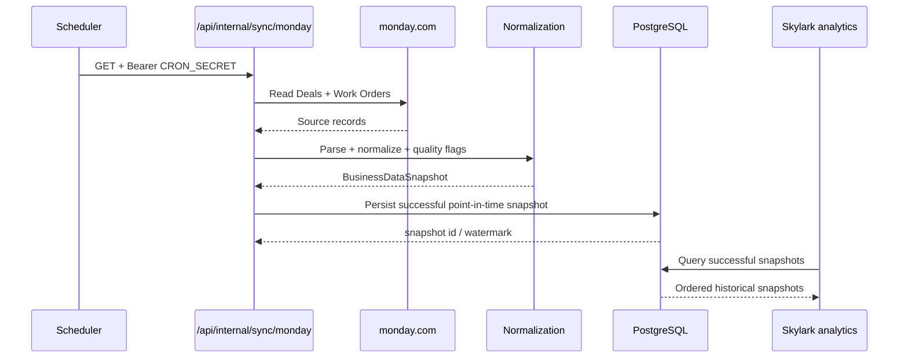
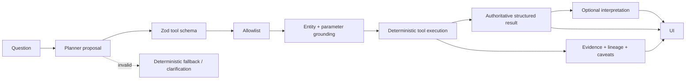

# Architecture

Skylark Command is a trust-native executive decision intelligence platform. Its architecture is designed around one invariant: **business truth must be deterministic, inspectable, and separable from generated interpretation.**

## System at a glance

## Architectural layers

### 1. Source integration

`src/lib/monday/**` is the live source boundary.

- Server-only credentials.
- Paginated GraphQL reads.
- `cache: "no-store"` for source fetches.
- Explicit mutation rejection.
- Typed mapping into source records before normalization.

The application does not embed a spreadsheet export as runtime truth.

### 2. Normalization

`src/lib/normalization/**` converts messy source values into typed `Deal` and `WorkOrder` records.

Important rules:

- Missing or malformed values become `null`, not guessed values.
- Currency semantics preserve source field meaning, including GST-inclusive versus GST-exclusive fields.
- Client keys are normalized deterministically for known formats.
- Unknown client formats are not fuzzily merged.
- Quality flags remain attached to normalized records.

This layer is intentionally boring: deterministic data preparation is easier to test, audit, and reason about than model-assisted cleanup.

### 3. Live and temporal data serving

`src/lib/data-platform/**` adds point-in-time history without forcing every public-demo deployment to use a database.

The serving mode is controlled by `SKYLARK_DATA_MODE`:

- `live` — public-demo/current-state reads fetch current monday.com data.
- `temporal_preferred` — serve the latest successful temporal snapshot when available, with live fallback according to the serving contract.
- `temporal_only` — require temporal storage.

Successful syncs can persist normalized snapshots into PostgreSQL through `PostgresTemporalSnapshotStore`. Snapshot queries are workspace-scoped, time-bounded, deterministic, and restricted to snapshots associated with successful sync runs.

The production-hardening layer adds migration checksum/drift detection, `001 → 002 → 003` migration ordering, historical indexes, bounded database connections, one-active-sync-per-workspace enforcement, abandoned-sync recovery, original sync-error preservation, and last-known-good/freshness behavior. No production migration or production cron activation is implied by the code existing.

No synthetic historical records are generated when durable history is missing.

## Temporal data flow

A snapshot is an observation of source state at a particular time. It is not an event log and it does not imply that every underlying change happened exactly at the capture timestamp.

### 4. Identity, workspaces, and RBAC

`src/lib/auth/**` and the workspace data-scope contract provide the server-owned authorization boundary.

- No workspace selector means **public read-only demo mode**.
- An explicit workspace selector requires a valid managed-auth identity and exact active membership.
- Managed identity validation uses Supabase Auth access tokens; the application then resolves the canonical role from persisted `workspace_members` rather than trusting a role claim from the client or JWT.
- Roles are `VIEWER`, `ANALYST`, `ADMIN`, and `OWNER`.
- Workspace-scoped analytics run inside an explicit workspace data scope; authenticated requests fail closed when isolated workspace data serving is not configured rather than falling back to public/another workspace.
- `VIEWER` may use authorized analytics but is blocked before Scenario Lab execution.
- Connector configuration stores credential references, not raw workspace secrets, and audit-event foundations are persisted server-side.

This is a backend identity/workspace/RBAC foundation. The repository does not claim a complete frontend login/account-management experience, workspace-specific secret resolution/sync, or production tenant onboarding.

### 5. Deterministic analytics

`src/lib/analytics/**` owns business calculation.

Responsibilities include:

- open pipeline and won-value analytics;
- stage/sector breakdowns;
- period analysis;
- Work Order execution and receivables health;
- customer rankings and contribution;
- Founder Attention;
- Customer 360;
- Change Intelligence;
- data quality;
- deterministic scenario re-runs and deltas.

Time-dependent analytics accept an explicit analysis date where required so tests do not depend on wall-clock behavior.

### 6. Semantic registry and lineage

`src/lib/semantic/**` describes what a metric means and how an answer was formed. It does **not** replace the analytics layer.

The registry captures:

- canonical metric IDs;
- dimensions;
- compatible filters;
- exact join definitions;
- metric versions;
- answer lineage;
- known/unknown value coverage;
- evidence-quality factors;
- source snapshot metadata.

This allows the product to answer both `What is the number?` and `Why should I trust this number?` using deterministic contracts.

### 7. Typed analytical tools

Founder Copilot does not receive arbitrary database or source-system capabilities. It selects from Zod-validated tool contracts such as:

- pipeline summary / by sector / by stage;
- customer contribution;
- Change Intelligence;
- Customer 360;
- receivables;
- Work Order health;
- period comparison;
- Scenario Lab.

Tool proposals are checked against an allowlist plus source/context grounding. A schema-valid but invented customer, sector, record ID, date, or amount is not automatically trusted.

### 8. Founder Copilot 2.0

The Copilot has two planning paths:

1. optional provider planning for natural-language flexibility;
2. deterministic fallback planning.

Both paths converge on the same typed tool registry. Provider absence or invalid output therefore affects language flexibility, not ownership of business truth.

Structured conversation context stores bounded analytical state—metric, dimension, entity, period, validated filters, previous tool call, snapshot reference—rather than handing the full prior conversation back as an untrusted instruction blob.

The canonical `/api/chat` route composes these Copilot semantics with public-demo/authenticated-workspace authorization and structured observability. It records result classifications, durations, selected deterministic tool IDs, provider-fallback events, and safe error categories without logging the prompt body or raw business records.

## Copilot trust flow

### 9. Scenario Lab

Scenario Lab is intentionally not a predictive model.

A scenario applies validated overrides to an immutable clone, reruns the same deterministic analysis used for the baseline, and computes deltas deterministically.

Examples include:

- moving a Deal close period/date;
- changing Deal outcome or inclusion;
- applying a receivable payment;
- setting a collection amount;
- delaying or resolving a Work Order.

There is no monday.com mutation path in the scenario engine. Workspace RBAC is evaluated before scenario execution, so a `VIEWER` request cannot enter the scenario engine.

### 10. Observability and reliability

`src/lib/server/**`, observed provider wrappers, and instrumented temporal-store operations implement a vendor-neutral operational signal layer.

- AsyncLocalStorage carries safe request/workspace/sync context through nested server operations.
- Valid inbound request IDs are preserved; otherwise a UUID is generated.
- Structured JSON events cover request latency, deterministic tool execution, provider planning/explanation, temporal database work, sync lifecycle, watermark/freshness, and result/error classification.
- Secret-like keys and configured credential values are redacted.
- Full prompt payloads, chain-of-thought, and raw source records are intentionally not logged.
- `/api/internal/diagnostics` is protected by timing-safe `CRON_SECRET` validation and can report bounded database/freshness diagnostics.
- Conservative alert-condition helpers cover repeated sync/database failures, stale snapshots, AI-provider failure rate, and API 5xx rate.
- `npm run eval:copilot` executes the fixed repository evaluation suite without claiming a generic AI-accuracy score.

No external observability vendor is required; a log drain/vendor can consume these stable events later.

### 11. Evidence-first UI

The UI surfaces analysis rather than hiding it behind chat text. Product components include:

- Overview / Founder Attention;
- Pipeline and Operations dashboards;
- Leadership Brief;
- Change Detective;
- Customer 360;
- Data Health;
- structured Copilot answers;
- charts for distributions, trends, financial flows, and deltas;
- source freshness, coverage, caveats, and evidence drawers.

Responsive hardening uses deterministic hydrated INR presentation, mobile interaction targets, nested Copilot scroll behavior, focus restoration, sticky-composer clearance, and reduced-motion support rather than suppressing hydration mismatches.

## FACT, ESTIMATE, INTERPRETATION

Skylark separates analytical truth by provenance rather than presenting every output as equally certain.

### FACT

A deterministic result derived directly from configured source data or persisted snapshots under a defined metric contract.

Examples: known open pipeline, known receivables, record counts, exact client matches, a before/after delta between two captured snapshots.

### ESTIMATE

A deterministic statistical result that depends on a documented method or threshold rather than a directly stored business value.

Example: a materiality classification derived from distribution-aware statistics such as median/MAD logic.

An estimate is still reproducible, but its method must be visible.

### INTERPRETATION

Natural-language explanation, prioritization wording, or synthesis generated after the analytical result exists.

Interpretation is useful for decision support but does not overwrite FACT or ESTIMATE values.

## Failure model

The system prefers an explicit partial answer or limitation over a fabricated complete answer.

| Failure | Expected behavior |
| --- | --- |
| Gemini unavailable | Preserve deterministic analytics; use fallback wording. |
| Invalid tool proposal | Reject, clarify, or use deterministic planner. |
| Unknown customer/sector | Fail closed with no-match behavior. |
| Missing value | Preserve `null` / known-only coverage. |
| No historical snapshot | Report insufficient history; do not synthesize one. |
| Temporal store unavailable in public live mode | Continue live according to serving mode. |
| Authenticated workspace has no isolated data serving | Fail closed; never fall into public/another workspace. |
| Invalid/suspended membership | Reject workspace access. |
| VIEWER scenario request | Deny before scenario execution. |
| Unsafe source mutation request | Not supported by the analytical tool surface. |
| Scenario override exceeds known baseline | Reject the override. |

## Key directories

| Path | Responsibility |
| --- | --- |
| `src/lib/monday` | Source access |
| `src/lib/normalization` | Typed normalization |
| `src/lib/data-platform` | Temporal persistence and serving |
| `src/lib/auth` | Managed identity, workspace membership, RBAC, connector refs, audit foundation |
| `src/lib/analytics` | Deterministic business logic |
| `src/lib/semantic` | Definitions, lineage, evidence quality |
| `src/lib/agent/v2` | Typed orchestration, scenarios, provider/evaluation contracts |
| `src/lib/server` | Request context, telemetry, safe errors, diagnostics, alerts |
| `src/components/change-intelligence` | Change Detective UI |
| `src/components/customers` | Customer 360 UI |
| `src/components/copilot` | Founder Copilot UI |
| `tests` / `*.test.ts` | Analytics, temporal, auth, trust, security, observability, and UI regression tests |

## Design consequence

The architecture intentionally contains more explicit contracts than a simple chat-over-API demo. That extra structure is the product: it makes an executive answer reproducible, traceable, isolated by workspace where requested, and safe to challenge.
