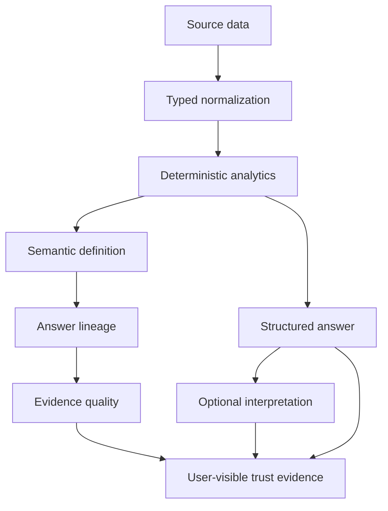

# Trust Model

Skylark Command treats trust as a product feature, not a disclaimer added after generation.

The system is designed so a user can ask four separate questions:

1. **What is the answer?**
2. **How was it calculated?**
3. **Which source evidence supported it?**
4. **What should I be cautious about?**

## Core invariant

> **The LLM can plan within typed boundaries and interpret an existing result. It cannot become the owner of business arithmetic.**

Pipeline, won value, receivables, counts, rankings, customer contribution, period comparisons, Change Intelligence deltas, and scenario deltas are produced by deterministic code.

## Trust classification

| Class | Meaning | Examples |
| --- | --- | --- |
| **FACT** | Deterministic result from configured source records/snapshots under an explicit metric contract | known open pipeline, Work Order count, exact customer join, snapshot-to-snapshot delta |
| **ESTIMATE** | Deterministic statistical inference using an explicit method | data-distribution materiality threshold or outlier-relative classification |
| **INTERPRETATION** | Optional generated explanation or synthesis over a completed analytical result | executive wording, explanatory summary, follow-up phrasing |

The UI and response contracts should never blur these categories.

## Trust pipeline

## 1. Source trust

### monday.com is read-only

The monday.com boundary is server-side and query-oriented. Mutation documents are rejected. Analytical and scenario tools do not expose a source-write capability.

### Temporal snapshots are observations, not invented events

When configured, successful syncs persist point-in-time normalized snapshots to PostgreSQL. Historical analytics query successful snapshots through the temporal-store contract.

If there is not enough history for a requested comparison, Skylark reports that limitation. It does not construct a fake previous week from the current dataset.

## 2. Data-quality trust

Messy operational data is expected.

Normalization follows these rules:

- missing/invalid numeric values → `null`;
- missing/invalid dates → `null`;
- known-only monetary sums do not silently convert nulls to zero;
- quality flags remain attached to records;
- known and unknown value coverage can be surfaced with answers;
- time-scoped analytics exclude records without usable time dimensions and disclose the consequence.

This is why Skylark uses phrases such as **known won value** instead of claiming complete historical revenue when the source is incomplete.

## 3. Metric trust

The semantic layer registers stable metric IDs and dimensions while the analytics layer remains the calculation owner.

Examples include:

- `open_pipeline_value`
- `known_won_value`
- `receivables`
- `open_deal_count`
- `active_work_order_count`

The semantic registry tells the system what a metric means, which dimensions are valid, and which deterministic analytical output owns the value.

## 4. Join trust

Cross-board customer intelligence uses exact equality after deterministic client-code normalization.

The product deliberately rejects fuzzy, embedding-based, edit-distance, or LLM-assisted business joins for authoritative metrics. A wrong join can create a convincing but false customer story, so unmatched keys remain visible instead.

## 5. Tool trust

Founder Copilot 2.0 operates over a typed analytical tool surface.

A model proposal must survive all of the following before execution:

1. strict Zod schema validation;
2. allowlisted tool ID validation;
3. source-entity validation;
4. grounding against the current question or structured context;
5. deterministic tool execution.

A tool name such as `runSql`, a monday mutation, or a fabricated customer does not gain authority because it came from a model.

## 6. Conversation trust

Multi-turn context is bounded analytical state rather than a raw transcript becoming a hidden instruction channel.

Context can retain:

- semantic metric ID;
- dimension;
- grounded entity;
- period;
- validated filters;
- previous typed tool call;
- source snapshot reference;
- previous result reference.

Follow-ups such as `Why?`, `Show only deals above ₹1Cr`, or `Compare that with last quarter` therefore operate on explicit state.

## 7. Provider trust and fallback

Gemini is optional.

If configured, it can help with typed planning and qualitative explanation. Provider absence, timeout, malformed output, rate limiting, failed trust guards, or ungrounded parameters must not force the analytics layer to guess.

Fallback behavior preserves deterministic results and uses deterministic planning/wording where supported.

## 8. Prompt-injection boundary

User text and monday-sourced cells are untrusted data.

Security controls include:

- fixed system instructions;
- explicit source-data serialization/delimiting;
- schema validation for generated plans/output;
- source-data instructions treated as content, not commands;
- no arbitrary GraphQL/SQL execution surface for the model;
- safe public errors rather than raw stack/cause serialization.

## 9. Scenario trust

Scenario Lab is a deterministic what-if engine, not a forecasting model.

Safety properties:

- source snapshots are cloned before overrides;
- record IDs must exist;
- IDs/dates/amounts must be grounded;
- receivable payments cannot exceed a known receivable baseline;
- unknown monetary baselines are not fabricated;
- baseline and scenario run the same deterministic analysis;
- delta is computed in code;
- no scenario writes to monday.com.

A scenario answers **“what would this deterministic metric become under these stated assumptions?”** It does not answer **“what is likely to happen?”**

## 10. Evidence quality

Evidence quality is deterministic and descriptive, not an AI confidence score.

The current policy considers factors such as:

- value completeness;
- snapshot freshness;
- exact-join coverage;
- temporal coverage;
- source-quality issues.

A weaker factor can lower the overall evidence class, with a human-readable reason.

## 11. Runtime security boundaries

Current controls include:

- server-only secrets;
- no `NEXT_PUBLIC_` path for source/provider credentials;
- strict JSON/request validation;
- request-size limits;
- request IDs;
- bounded external calls/timeouts;
- safe error envelopes;
- security headers;
- process-local per-client rate limiting;
- authenticated temporal sync endpoint using `CRON_SECRET`.

### Known production-hardening gap

The current chat limiter is process-local. On horizontally scaled/serverless deployments, a distributed rate-limit backend would provide stronger global enforcement. The architecture keeps rate limiting isolated so that backend can be replaced without changing the Copilot contract.

Organization SSO/RBAC and deployment-level identity policy are also deployment concerns rather than capabilities claimed by the current repository.

## 12. What Skylark does not claim

Skylark does **not** currently claim:

- predictive pipeline-conversion ML;
- collections-risk ML;
- delivery-risk ML;
- autonomous write-back to CRM/operations systems;
- fuzzy identity resolution as authoritative truth;
- complete historical business coverage when snapshots are sparse;
- full enterprise identity/governance infrastructure.

Predictive models are a future research direction only when enough point-in-time history exists to train and evaluate them defensibly.

## Trust close

The product philosophy can be summarized as:

> **Ask what changed. See why. Verify the evidence. Decide what happens next.**
